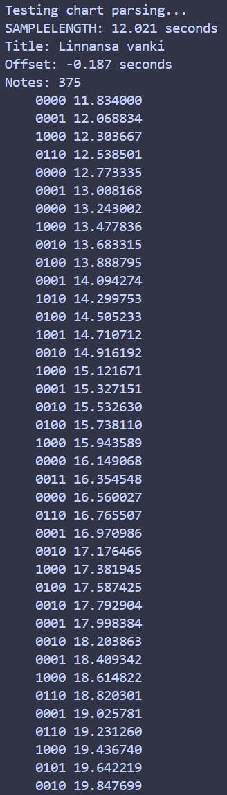
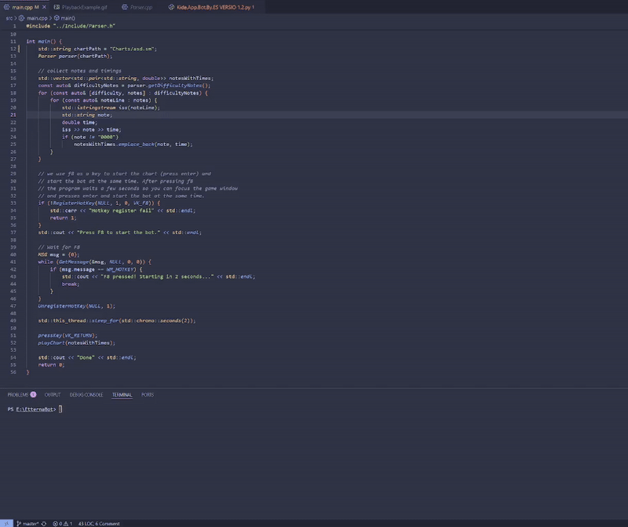

# SMfilePlayer 

SMfilePlayer is a parser and playback engine for `.sm` rhythm game charts.

This project parses `.sm` files and plays them back perfectly. To achieve this the project includes:

- Chart parsin logic

- Playback engine with timing synchronization

## Why I Built This

I play a lot of rythm games that use `.sm` charts. I searched online but couldn’t find a bot like this, so I decided to build one myself. 

## Usage

 **Build the bot:**
   ```sh
   g++ -std=c++17 -I./Include -o EtternaBot src/main.cpp src/Parser.cpp src/Bot.cpp
   ```

 **Prepare your chart:**  
   Place your `.sm` file in the `Charts/` directory and update the path in `main.cpp`.

 **Run the bot:**  
   ```sh
   ./EtternaBot
   ```
## Limitations

- The bot cannot be used directly in games like Etterna or StepMania because they implement software-level anti-cheat measures that block simulated keyboard inputs.

- To bypass these limitations, a hardware input emulator is needed to send physical keypresses indistinguishable from real ones.
  
- The parser currently supports only  `.sm` files with a single BPM and no complex timing changes like stops or multiple BPM changes.

## How It Works 
<p>Parser output and Bot playing .sm chart:</p>
<div style="white-space: nowrap;">
  
  
</div>


This project consists of three main parts that work together to parse and play .sm rhythm game charts:

- Parser: Reads the .sm file, extracting chart metadata (like BPM and offset) and note data organized by difficulty. It breaks the chart into measures, converts notes into a normalized format, and calculates precise real-time timestamps for each note based on BPM and measure position.
- Bot: Acts as the playback engine and input simulator. It maps notes (strings like "1000") to specific keyboard keys (Q, W, E, R), starts a high-precision timer, and waits until the exact moment to simulate key presses for each note. The bot uses Windows’ SendInput with scan codes to emulate keyboard input, attempting to bypass game anti-cheat systems. Playback can be stopped at any time by pressing ESC.
- Main: Coordinates the process by loading the chart, collecting parsed notes and timings, registering a hotkey (F8) to start playback, and giving the user a few seconds to focus the game window before triggering the bot to press Enter and begin playing the chart automatically.

## What I Learned
Through this project, I gained experience parsing a custom, nested file format and converting raw chart data into timed events. I implemented precise playback timing and synchronization using high-resolution clocks. Additionally, I applied fundamental music theory concepts to calculate note timings accurately.
